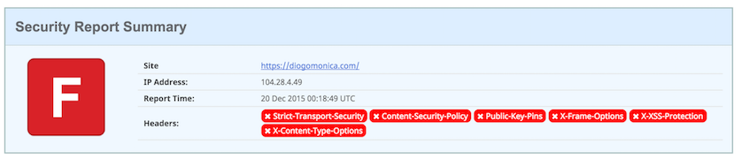
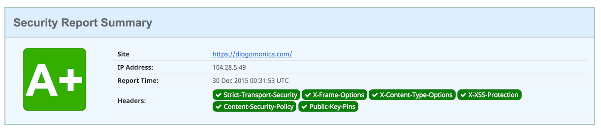

From F to A+: Getting Good Grades on Website Security Evaluations
=================================================================

Even though diogomonica.com is a statically generated blog, created using [Jekyll](https://jekyllrb.com), it’s always fun to run it through security evaluation websites such as [SSL Labs](https://www.ssllabs.com/ssltest/) and [Security Headers](https://securityheaders.io).

Unfortunately, last week, when I ran it through [securityheaders.io](https://securityheaders.io)’s checker, I got the following result:

This is obviously embarrassing for someone who works in security, and even though my blog has no need for advanced security headers, I decided to change that rating to an A+.

What are these headers?
-----------------------

Before we turn those red warning boxes into a more pleasant light green, let me give you a high-level overview of what these headers are, and why you should make sure to include them in your web properties.

* **Content-Security-Policy (CSP)**: allows the website to define a policy concerning which domains external javascripts, css, images, etc, can be imported and rendered from. Prevents XSS and other cross-site injections.
* **X-Content-Type-Options**: prevents IE and Google Chrome from MIME-sniffing a response away from the declared content-type.
* **X-Frame-Options**: protects against clickjacking attacks.
* **X-XSS-Protection**: essentially useless; it comes enabled by default in modern browsers.
* **Strict-Transport-Security (HSTS)**: tells your browser to always connect to a particular domain over HTTPS. Attackers aren’t able to downgrade connections, and users can’t ignore TLS warnings.
* **Public-Key-Pins (HPKP)**: tells your browser to associate a specific public key fingerprint with a particular domain. Prevents against an attacker getting a valid certificate from one of the hundreds of other Certificate Authorities out there.

Fixing the easy ones
--------------------

This is a lot less fun to do in a production setting, since changes like this have a tendency to break obscure corners of your application, but these headers are trivial to setup and will probably have minimal impact on your website.

Since I’m running nginx as my webserver, I’ll have to add *add\_header* directives to my configuration file:

    add_header X-Frame-Options "SAMEORIGIN";
    add_header X-Content-Type-Options nosniff;
    add_header X-XSS-Protection "1; mode=block";

There isn’t a lot to consider when choosing the arguments for these three headers, but if you want more information about them, make sure you consult the [Mozilla Headers page](https://developer.mozilla.org/en-US/docs/Web/HTTP/Headers).

Adding HSTS and CSP to the mix
------------------------------

If you deploy an over-aggressive CSP policy, browsers might disallow resources from being loaded and your website will break. If you deploy an HSTS policy and at a later time disable HTTPS on your website/application, users will temporarily be disallowed access to your website.

### HSTS

Since I’m always going to run my website over TLS, I’m enabling HSTS with a [*max-age*](https://developer.mozilla.org/en-US/docs/Web/Security/HTTP_strict_transport_security) parameter of 7776000 (seconds). This will tell browsers that, for the next three months, they should only attempt accessing diogomonica.com over HTTPS:

    add_header Strict-Transport-Security max-age=7776000;

Another important HSTS parameter is *includeSubDomains*, which I’m leaving disabled, since it’s common for me to run non-https demo sites under \*.diogomonica.com. You should enable it if you’re sure every single sub-domain will always be using HTTPS.

### CSP

CSP has two different modes of operation: enforce and report. If you use the *Content-Security-Policy* header, CSP will operate in enforce mode; if you use *Content-Security-Policy-Report-Only* it will operate in report mode.

CSP is pretty complex, and I recommend enabling it in report mode first, since it will allow you to understand the changes you need to make to enable enforcement later on. You should also read about the different [CSP policy directives](https://developer.mozilla.org/en-US/docs/Web/Security/CSP/CSP_policy_directives).

In my particular case, since no one will ever complain about my blog being broken, I jumped straight to enforce mode and, with the help of the Chrome Developer console, fixed the red-warnings one by one, resulting in this final policy:

    add_header Content-Security-Policy "default-src 'self'; script-src 'self' 'unsafe-eval' https://ssl.google-analytics.com https://ajax.cloudflare.com; img-src 'self' https://ssl.google-analytics.com ; style-src 'self' 'unsafe-inline' https://fonts.googleapis.com; font-src 'self' https://fonts.googleapis.com https://fonts.gstatic.com; object-src 'none'";

This is the current rating on [securityheaders.io](https://securityheaders.io), after restarting my nginx server:

### Getting to A+ (enabling HPKP)

HPKP works by having the browser lookup the HPKP headers and check whether any of those pins match any of the [SPKI fingerprints](https://raymii.org/s/articles/HTTP_Public_Key_Pinning_Extension_HPKP.html) in the certificate chain. This means that you can use a pin from anywhere in the chain: from a leaf certificate all the way up to the root certificate.

Since the [RFC](https://tools.ietf.org/html/rfc7469) states that you need to provide at least two pins, I created a new public/private key pair and stored it offline. After that, I got the SPKI fingerprint for both my keys. There are a [few different ways](https://developer.mozilla.org/en-US/docs/Web/Security/Public_Key_Pinning) to do it.

I got the fingerprint from my current certificate using the following openssl command:

    root@burly:/etc/ssl\# openssl x509 -in cloudflare-diogomonica.com.crt -pubkey -noout | openssl rsa -pubin -outform der | openssl dgst -sha256 -binary | base64
    bDk6Wbfj83EpcaKgT5WkBfiiml66Tln3DskDJneGBoo=

HPKP is probably the most dangerous of all the security headers. Like HSTS, if something goes wrong (your private key gets compromised), users might be disallowed from accessing your website for the duration you specify in your *max\_age* argument. Also, like CSP, HPKP actually comes with a *Report-Only* version, which allows you to test your pins, without risking downtime. I recommend this [great blog post](https://timtaubert.de/blog/2014/10/http-public-key-pinning-explained/) by Tim Taubert for more info on HPKP.

As I mentioned before, the lack of readership of this blog allows me to jump right into enforcement mode, adding this new header to my nginx config:

    add_header Public-Key-Pins 'pin-sha256="bDk6Wbfj83EpcaKgT5WkBfiiml66Tln3DskDJneGBoo="; pin-sha256="E8WztKzM3elUxkcjR2S5P4hhyBNf6lHkmjAHKhpGWooE="; max-age=60';

I will point out that, even though I was being cavalier, I did set a *max\_age* of 60 seconds for testing, allowing me to simply disable the header and wait a minute if I messed the PINs somehow.

If you want to reduce the risk of losing your keys or remove the need of having to deal with offline key-pairs, you can pin to a root CA. That will increase your surface of attack, but it will also make it easier to get a new valid certificate later. I would recommend pinning to Let’s Encrypt, but be sure to read [this](https://community.letsencrypt.org/t/hpkp-best-practices-if-you-choose-to-implement/4625) before you do.

Just show me the screenshot!
----------------------------

After restarting nginx with all of our new headers, voilà, A+.

This sounds like a lot of work, can I cheat my way to A+?
---------------------------------------------------------

Since [securityheaders.io](https://securityheaders.io) is only checking for the presence of the header (it doesn’t even attempt to parse parameters), the answer is yes:

    add_header Strict-Transport-Security max-age=0;
    add_header X-Frame-Options "ANYTHINGREALLY";
    add_header X-Content-Type-Options anythingreally;
    add_header X-XSS-Protection "0";
    add_header Content-Security-Policy "default-src \*";
    add_header Public-Key-Pins max-age=0;

What about getting an A+ on SSL Labs?
-------------------------------------

If you’re ok with an A, use [cloudflare](https://cloudflare.com). If you really want that A+, you can follow [this post](https://sethvargo.com/getting-an-a-plus-on-qualys-ssl-labs-tester/).

Conclusion
----------

With the exception of HPKP, which I wouldn’t really recommend enabling unless you have a very mature SecOps team, all of these headers should be enabled on any production website you deploy.

Remember: it will be a lot easier to iterate on configuration changes if you’re not currently serving any traffic, so do it sooner rather than later. :)
