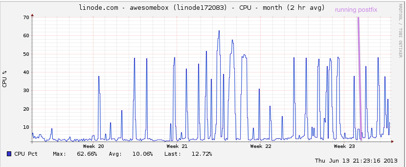

NSA-proof your e-mail in 2 hours
================================

You may be concerned that the NSA is reading your e-mail. Is there really anything you can do about it though? After all, you don’t really want to move off of GMail / Google Apps. And no place you would host is any better.

Except, you know, hosting it yourself. The way that e-mail was *originally designed to work*. We’ve all just forgotten because, you know, webapps-n-stuff. It’s a lot of work, mkay, and I’m a lazy software developer.

Today we kill your excuses. Because I’m going to show you exactly how to do it, it’s going to take about two hours to set up, and it’s a “set it and forget it” kind of setup. Not only that, but it is actually going to be **better** than GMail, from a purely features perspective. It might surprise you to learn that people continue to develop email server software in a post-Google-apps world, and that the state of self-hosted is much better than you remember.

Now fair warning: it took me about two days to figure the stuff out you’re going to see in this blogpost, starting from knowing basically nothing about modern e-mail servers. But now that I’ve figured it out, if you don’t ask too many questions you can implement it from these notes in just two hours. So take this not just as a guide for setting up an e-mail server, but as two days of free consulting, that just happens to produce a complete recipe for a modern, fully-featured, fast email server at the end. *You’re really going to turn down free consulting? Come on, buckle down and do this.*

So bookmark this blog post, block off a Saturday next month, and get it done. Seriously. If you are still using GMail (or Yahoo, or arbitrary US-based email company) in August, **your right to complain about the NSA spying on you is revoked**. If you’re complaining about government spying on the Internet, or in a gathering of programmers, and you won’t take *basic steps* to do anything about it, then you’re a hypocrite, full-stop. I will personally come to your terminal and demand the return of your complain license. Pick a weekend, get it done. Or just admit that you’re okay with it. Either way, just be consistent.

**Edit** Some people are complaining that the NSA is pulling all the e-mail over the wire anyway, so encrypting your own server is stupid. **However, these people are not aware of just how much e-mail goes over TLS.** For example, if you follow this guide, every message to or from a GMail / Google Apps account goes over TLS. I measured it, and that’s **a third** of my ham volume. And Google isn’t a special snowflake; any reasonably-configured mail will be encrypted over the wire. It’s 2013; people have been getting TLS into wide adoption for awhile now.

In the next two hours, we’re going to fix this. You’re going to build a modern, 2013, e-mail stack. From scratch. Or something.

* You’re going to host your own mail.
* It’s going to be encrypted on the server, locked-on-boot, SSH on reboots to unlock
* While we’re at it, let’s fix some things that annoy me about GMail:
  * Better SPAM detection. Yes, you can beat the Big G.
  * Push support that actually works. Little known fact: Google [discontinued push for iOS](http://googleblog.blogspot.com/2012/12/winter-cleaning.html) earlier this year. Also little known fact: push has never worked in OSX Mail.app. We’re gonna fix it. Lightning fast push on all the devices.
  * Full-text search. Believe it or not, mail search on my iPhone is pretty bad under GMail. Three out of four Google Suggest results for “iPhone mail search” are “doesn’t work”, “not working”, and “slow”. Our version is going to be working, working, and fast. Take that, Google.

I’m going to assume:

* You’re running Debian Wheezy
* You know your way around Linux more or less. Experience running Apache or Lighttpd or Nginx, etc.
* You have root access
* Nobody really cares if you mess anything up.
* You’re not stupid and you know how to google things

Hang on just a minute though. Doesn’t hosting your own mail require beefy hardware to deal with the spams? **Not really**. I get a **lot** of mail, and this is my graph:

Doesn’t it go down a lot though? Getting up in the middle of the night to do server reboots and that?

Again, **not really**. RFC 2821 requires that mail servers try for “at least 4-5 days” to deliver your mail. Let’s just say, that’s a lot more forgiving than running Apache.

A crash course on e-mail
========================

The people who have designed e-mail software are, on the whole, people with a lot more problems than you. Unfortunately this means there are a lot of separate little projects that work together.

* Postfix – this is called an “MTA” in the email lingo. Essentially it runs SMTP, and delivers incoming mail to Dovecot.
* Dovecot – this is the “LDA” in the email lingo. Essentially it runs IMAP.
* EncFS – this is what we use to encrypt our email store
* opendkim – implements DKIM authentication
* spamd – antispam
* z-push – better push support
* mySQL – really we’re going to use this to hold information about users and domains, but nothing really sensitive.

Let’s get started!

Security Foreward
=================

I assume you kinda-sorta know how to configure a secure server on the Internet and have done so for your mail server. If you don’t know what I’m talking about, time to read [my first 5 minutes on a server](my-first-5-minutes-on-a-server-or-essential-security-for-linux-servers.md).

DNS
===

We should probably start configuring your DNS, since that stuff takes awhile. If you have an existing domain, you might want to lower the TTL on your MX records to the smallest possible setting. That way you can switch over when you’re ready.

For this article, I’m going to set up my mailserver running on a subdomain – drew@awesomebox.sealedabstract.com. So I configure an MX record that points mail for the subdomain to my server.

EncFS
=====

    $ apt-get install encfs
    mkdir /encrypted-mail /decrypted-mail
    chgrp mail /decrypted-mail/
    chmod -R g+rw /decrypted-mail/
    gpasswd -a mail fuse
    chgrp fuse /dev/fuse; chmod g+rw /dev/fuse
    root@li212-205:~# encfs /encrypted-mail /decrypted-mail -o --public
    Creating new encrypted volume.
    Please choose from one of the following options:
     enter "x" for expert configuration mode,
     enter "p" for pre-configured paranoia mode,
     anything else, or an empty line will select standard mode.
    ?> p
    Paranoia configuration selected.
    Configuration finished.  The filesystem to be created has
    the following properties:
    Filesystem cipher: "ssl/aes", version 3:0:2
    Filename encoding: "nameio/block", version 3:0:1
    Key Size: 256 bits
    Block Size: 1024 bytes, including 8 byte MAC header
    Each file contains 8 byte header with unique IV data.
    Filenames encoded using IV chaining mode.
    File data IV is chained to filename IV.
    File holes passed through to ciphertext.
    -------------------------- WARNING --------------------------
    The external initialization-vector chaining option has been
    enabled.  This option disables the use of hard links on the
    filesystem. Without hard links, some programs may not work.
    The programs 'mutt' and 'procmail' are known to fail.  For
    more information, please see the encfs mailing list.
    If you would like to choose another configuration setting,
    please press CTRL-C now to abort and start over.
    Now you will need to enter a password for your filesystem.
    You will need to remember this password, as there is absolutely
    no recovery mechanism.  However, the password can be changed
    later using encfsctl.
    New Encfs Password:
    Verify Encfs Password:

It’s that simple. `/decrypted-mail` is now a regular directory. `/encrypted-mail` is that same data, just encrypted.

It’s important to use the `--public` option with EncFS. This is because by default, EncFS goes to great lengths to be a lot narrower than the standard UNIX permissions model. Meanwhile, we have a lot of UNIX users who expect standard UNIX behaviors.

Any time we want to mount the `/decrypted-mail` dir, we run the same `encfs` command again, and this time it mounts the folder, instead of creating it.

OpSec
-----

It’s important as a practical matter that you keep other people off your root. It goes without saying, but there are a lot of attack vectors (like physical access, or access through a VPS admin panel) that could potentially allow your host, acting under the direction of a government agent, to run commands as root, and take your mail.

For security reasons, I’m not going to disclose the measures that I take to avoid others gaining root on my system. A good start might be changing your root password, or keeping your mail server under your pillow at night.

Postfix
=======

    apt-get install postfix postfix-mysql dovecot-core dovecot-imapd dovecot-mysql mysql-server dovecot-lmtpd

Postfix prompts you with a bunch of information–the one that you want is “Internet Site”. It’s also the default.

Postfix prompts you for a “mail name” – I chose awesomebox.sealedabstract.com.

About 60 seconds later, you’ve got a mail server. Now to configure it. First we need to derive our password.

    doveadm pw -s SHA512-CRYPT

This will give you a string like `{SHA512-CRYPT}$6$gJ8hXjMn/lePALEt$JMX1jd...` The part after “{SHA512-CRYPT}” is the hash for your password. It always starts with “$6$”.

    mysqladmin -p create mailserver
    mysql -p mailserver
    mysql> GRANT SELECT ON mailserver.* TO 'mailuser'@'127.0.0.1' IDENTIFIED BY 'mailuserpass';
    mysql> FLUSH PRIVILEGES;
    mysql> CREATE TABLE `virtual_domains` (
      `id` int(11) NOT NULL auto_increment,
      `name` varchar(50) NOT NULL,
      PRIMARY KEY (`id`)
    ) ENGINE=InnoDB DEFAULT CHARSET=utf8;
    mysql> CREATE TABLE `virtual_users` (
      `id` int(11) NOT NULL auto_increment,
      `domain_id` int(11) NOT NULL,
      `password` varchar(106) NOT NULL,
      `email` varchar(100) NOT NULL,
      PRIMARY KEY (`id`),
      UNIQUE KEY `email` (`email`),
      FOREIGN KEY (domain_id) REFERENCES virtual_domains(id) ON DELETE CASCADE
    ) ENGINE=InnoDB DEFAULT CHARSET=utf8;
    mysql> CREATE TABLE `virtual_aliases` (
      `id` int(11) NOT NULL auto_increment,
      `domain_id` int(11) NOT NULL,
      `source` varchar(100) NOT NULL,
      `destination` varchar(100) NOT NULL,
      PRIMARY KEY (`id`),
      FOREIGN KEY (domain_id) REFERENCES virtual_domains(id) ON DELETE CASCADE
    ) ENGINE=InnoDB DEFAULT CHARSET=utf8;
    mysql> INSERT INTO `mailserver`.`virtual_domains`
      (`id` ,`name`)
    VALUES
      ('1', 'awesomebox.sealedabstract.com');

You could also configure additional domains here if desired.

    mysql> INSERT INTO `mailserver`.`virtual_users`
      (`id`, `domain_id`, `password` , `email`)
    VALUES
      ('1', '1', '$6$YOURPASSWORDHASH', 'drew@awesomebox.sealedabstract.com');

Again, you could also configure multiple users here.

    mysql> exit

Okay, now let’s configure postfix. Let’s back up the original file:

    cp /etc/postfix/main.cf /etc/postfix/main.cf.orig
    nano /etc/postfix/main.cf

Comment out the “TLS parameters”, and use these instead:

    smtpd_tls_cert_file=/etc/ssl/certs/dovecot.pem
    smtpd_tls_key_file=/etc/ssl/private/dovecot.pem
    smtpd_use_tls=yes
    smtpd_tls_auth_only = yes
    smtp_tls_security_level = may
    smtp_tls_loglevel = 2
    smtpd_tls_received_header = yes

Below the TLS parameters, paste these:

    smtpd_sasl_type = dovecot
    smtpd_sasl_path = private/auth
    smtpd_sasl_auth_enable = yes
    smtpd_recipient_restrictions =
            permit_sasl_authenticated,
            permit_mynetworks,
            reject_unauth_destination

There’s a line that sets “mydestination” to a wide variety of domains. Make sure it’s only set to localhost.

    mydestination = localhost

At the very bottom of the file, paste this:

    virtual_transport = lmtp:unix:private/dovecot-lmtp
    virtual_mailbox_domains = mysql:/etc/postfix/mysql-virtual-mailbox-domains.cf
    virtual_mailbox_maps = mysql:/etc/postfix/mysql-virtual-mailbox-maps.cf
    virtual_alias_maps = mysql:/etc/postfix/mysql-virtual-alias-maps.cf
    local_recipient_maps = $virtual_mailbox_maps

This essentially points postfix at Dovecot and the MySQL tables.

Okay, so now we’re going to create the three files we specified earlier.

    nano /etc/postfix/mysql-virtual-mailbox-domains.cf

.

    user = mailuser
    password = mailuserpass
    hosts = 127.0.0.1
    dbname = mailserver
    query = SELECT 1 FROM virtual_domains WHERE name='%s'

Similarly, for `/etc/postfix/mysql-virtual-mailbox-maps.cf`:

    user = mailuser
    password = mailuserpass
    hosts = 127.0.0.1
    dbname = mailserver
    query = SELECT 1 FROM virtual_users WHERE email='%s'

Finally, for /etc/postfix/mysql-virtual-alias-maps.cf:

    user = mailuser
    password = mailuserpass
    hosts = 127.0.0.1
    dbname = mailserver
    query = SELECT destination FROM virtual_aliases WHERE source='%s'

So let’s restart postfix:

    service restart postfix

And verify that it works:

    $ postmap -q awesomebox.sealedabstract.com mysql:/etc/postfix/mysql-virtual-mailbox-domains.cf
    1
    $ postmap -q drew@awesomebox.sealedabstract.com mysql:/etc/postfix/mysql-virtual-mailbox-maps.cf
    1

Looks good.

Dovecot
=======

So first, let’s backup all the config files:

    cp /etc/dovecot/dovecot.conf /etc/dovecot/dovecot.conf.orig
    cp /etc/dovecot/conf.d/10-mail.conf /etc/dovecot/conf.d/10-mail.conf.orig
    cp /etc/dovecot/conf.d/10-auth.conf /etc/dovecot/conf.d/10-auth.conf.orig
    cp /etc/dovecot/dovecot-sql.conf.ext /etc/dovecot/dovecot-sql.conf.ext.orig
    cp /etc/dovecot/conf.d/10-master.conf /etc/dovecot/conf.d/10-master.conf.orig
    cp /etc/dovecot/conf.d/10-ssl.conf /etc/dovecot/conf.d/10-ssl.conf.orig

And edit the main one:

    nano /etc/dovecot/dovecot.conf

Down at the bottom, we’re going to enable imap:

    protocols = imap

So far, so good. Now edit another config file:

    nano /etc/dovecot/conf.d/10-mail.conf

We patch the variables listed below:

    mail_location = maildir:/decrypted-mail/%d/%n
    mail_privileged_group = mail
    first_valid_uid = 0

Now we edit the auth file:

    nano /etc/dovecot/conf.d/10-auth.conf

Here are the values we patch:

    disable_plaintext_auth = yes
    auth_mechanisms = plain login
    #INSERT a hashtag in front of the following import.  This separates your mail server's login from UNIX logins.
    #!include auth-system.conf.ext
    #REMOVE the hashtag in front of the following import.  This points it at mysql for authentication.
    !include auth-sql.conf.ext

Now let’s configure that SQL in more detail:

    nano /etc/dovecot/conf.d/auth-sql.conf.ext

.

    passdb {
      driver = sql
      args = /etc/dovecot/dovecot-sql.conf.ext
    }
    userdb {
      driver = static
      args = uid=mail gid=mail home=/decrypted-mail/%d/%n
    }

Edit *yet another config file*

    nano /etc/dovecot/dovecot-sql.conf.ext

.

    driver = mysql
    connect = host=127.0.0.1 dbname=mailserver user=mailuser password=mailuserpass
    default_pass_scheme = SHA512-CRYPT
    password_query = SELECT email as user, password FROM virtual_users WHERE email='%u';

Now I know what you’re thinking. SHA512? Why not bcrypt?

In theory dovecot supports the argument BLF-CRYPT here (e.g. bcrypt) but in practice only if your libc provides bcrypt. SUSE is the only Linux that has bcrpt in its libc. This topic comes up enough that Ulrich Drepper has an [entire webpage on this topic](http://www.akkadia.org/drepper/sha-crypt.html).

In practice you can do any of the following: A) use SHA512-CRYPT, B) Switch to SUSE, C) Switch to Real Unix, D) whine at Ulrich Drepper, E) whine at NIST. I’ve chosen choice A. If it makes you feel any better, it’s been vetted by HP, IBM, RH, and Sun.

    chown -R mail:dovecot /etc/dovecot
    chmod -R o-rwx /etc/dovecot

.

    nano /etc/dovecot/conf.d/10-master.conf

We’re setting our ports to zero. This essentially forces people to use “secure” sockets. You know, cause we’re paranoid.

    service imap-login {
      inet_listener imap {
        port = 0
      }
    ...
    service pop3-login {
      inet_listener pop3 {
        port = 0
      }
    ...

For the service lmtp, we use as follows:

    service lmtp {
      unix_listener /var/spool/postfix/private/dovecot-lmtp {
        mode = 0666
        group = postfix
        user = postfix
      }
      # Create inet listener only if you can't use the above UNIX socket
      #inet_listener lmtp {
        # Avoid making LMTP visible for the entire internet
        #address =
        #port =
      #}
      user=mail
    }

We’ll replace the whole “service auth” and “service auth-worker” section with this one:

    service auth {
      # auth_socket_path points to this userdb socket by default. It's typically
      # used by dovecot-lda, doveadm, possibly imap process, etc. Its default
      # permissions make it readable only by root, but you may need to relax these
      # permissions. Users that have access to this socket are able to get a list
      # of all usernames and get results of everyone's userdb lookups.
      unix_listener /var/spool/postfix/private/auth {
        mode = 0666
        user = postfix
        group = postfix
      }
      unix_listener auth-userdb {
        mode = 0600
        user = mail
        #group =
      }
      # Postfix smtp-auth
      #unix_listener /var/spool/postfix/private/auth {
      #  mode = 0666
      #}
      # Auth process is run as this user.
      user = dovecot
    }
    service auth-worker {
      # Auth worker process is run as root by default, so that it can access
      # /etc/shadow. If this isn't necessary, the user should be changed to
      # $default_internal_user.
      user = mail
    }

Generate those SSL certs:

    openssl req -new -x509 -days 1000 -nodes -out "/etc/ssl/certs/dovecot.pem" -keyout "/etc/ssl/private/dovecot.pem"

And set them in the config file:

    nano /etc/dovecot/conf.d/10-ssl.conf
    ssl_cert = </etc/ssl/certs/dovecot.pem
    ssl_key = </etc/ssl/private/dovecot.pem
    ssl = required

Let’s kick the server:

    service dovecot restart

At this point, it should basically work. You should be able to send and receive mail. Go ahead and try it! You should be running IMAP on 993 (standard SSL port) and you should be able to log in with the e-mail and password you set.

Note that you can get debug information with

    tail /var/log/mail.log

You can also test “over-the-wire TLS”. When you send a message, mail.log should show this:

    Jul 15 19:20:52 li212-205 postfix/smtp[17453]: Untrusted TLS connection established to ASPMX.L.GOOGLE.com[2607:f8b0:4003:c02::1b]:25: TLSv1.2 with cipher ECDHE-RSA-RC4-SHA (128/128 bits)

When you receive a message, this header will appear:

    Received: from mail-ob0-f169.google.com (mail-ob0-f169.google.com [209.85.214.169]) (using TLSv1 with cipher ECDHE-RSA-RC4-SHA (128/128 bits)) (No client certificate requested) by mailserver.com (Postfix) with ESMTPS id 7F90E1CC71D for <drew@sealedabstract.com>; Mon, 15 Jul 2013 19:28:07 -0400 (EDT)

However, we should set up some more things.

Getting through SPAM filters
============================

If setting up an e-mail server was that easy, spammers would do it. Alas.

You should go read Jeff Atwood’s [‘so you’d like to send some e-mail’](http://www.codinghorror.com/blog/2010/04/so-youd-like-to-send-some-email-through-code.html) for the details, but we’re going to set up SPF, OpenDKIM, and (maybe) PTR.

OpenDKIM
--------

    apt-get install opendkim opendkim-tools
    mkdir -pv /etc/opendkim/
    chown -Rv opendkim:opendkim /etc/opendkim
    chmod go-rwx /etc/opendkim/*
    cd /etc/opendkim/
    opendkim-genkey -r -h rsa-sha256 -d awesomebox.sealedabstract.com -s mail
    mv -v mail.private mail
    cat mail.txt

This will output our DKIM key to the terminal. Then, we install it on our DNS server. My ZONE file looks like this. Unfortunately it doesn’t wrap very well in this blog post.

    mail._domainkey.awesomebox      300 TXT "v=DKIM1; h=rsa-sha256; k=rsa; p=MIGfMA0GCSqGSIb3DQEBAQUAA4GNADCBiQKBgQDbLRiNXX9zxAtdw45Vsd35d/1VQZUFG8ejfQu6aql74obJhTESaqANBbOkNaD0xb+2kuN/w+2725Gv2tTPAcHfBZogyazkwtNrlNQV2h3q4ub/UTkn0AHeq0P/RMtmhV+hKRzk0hcYWPlzWMoR5ZGWwMYdhbocTeBX4Mc2pWEYewIDAQAB"

Returning to our Wheezy box, let’s configure postfix to use that key:

    nano /etc/opendkim/KeyTable
    awesomebox.sealedabstract.com awesomebox.sealedabstract.com:mail:/etc/opendkim/mail

.

    nano  /etc/opendkim/SigningTable
    *@awesomebox.sealedabstract.com awesomebox.sealedabstract.com

.

    nano /etc/opendkim/TrustedHosts
    127.0.0.1

.

    nano /etc/opendkim.conf
    ##
    ## opendkim.conf -- configuration file for OpenDKIM filter
    ##
    Canonicalization        relaxed/relaxed
    ExternalIgnoreList      refile:/etc/opendkim/TrustedHosts
    InternalHosts           refile:/etc/opendkim/TrustedHosts
    KeyTable                refile:/etc/opendkim/KeyTable
    LogWhy                  Yes
    MinimumKeyBits          1024
    Mode                    sv
    PidFile                 /var/run/opendkim/opendkim.pid
    SigningTable            refile:/etc/opendkim/SigningTable
    Socket                  inet:8891@localhost
    Syslog                  Yes
    SyslogSuccess           Yes
    TemporaryDirectory      /var/tmp
    UMask                   022
    UserID                  opendkim:opendkim

Now we return to /etc/postfix/main.cf and add (to the bottom)

    smtpd_milters           = inet:127.0.0.1:8891
    non_smtpd_milters       = $smtpd_milters
    milter_default_action   = accept

Allright, let’s check it out!

    service opendkim restart
    service postfix restart

SPF
---

SPF is simpler. All you have to do is edit your zone:

    awesomebox      300 TXT "v=spf1 mx -all"

All I am saying here is “the mail server for awesomebox can send mail for awesomebox” You’d think it would be obvious, but recall at the start, the observation that this system was designed by people who have far more problems than you. At scale, you probably have more than one mail server.

You can also debug your DKIM (and SPF) settings with e.g. [this tool](http://www.brandonchecketts.com/emailtest.php).

Reverse PTR
-----------

This is not as hard as [Jeff](http://www.codinghorror.com/blog/2010/04/so-youd-like-to-send-some-email-through-code.html) leads you to believe. If you’re hosting with Linode (and you [should](http://www.linode.com/?r=fd5631c5c3e6938080e281bdaa81ba9580e7fd6b)) it’s right on the config panel.

    Linodes-\>[name]-\>Remote Access-\>Reverse DNS-\>Type in your hostname. Done.

Spam
====

Let’s move on to everybody’s favorite: fighting spam. The inbound kind.

People argue about what is the best antispam tool. **Argument over: dspam**. I’ve found it quite a bit better than e.g. SpamAssassin and the other traditional tools. It takes some time to train, so it doesn’t work “right out of the box”. But after a few days, my spam detection has been **great**.

    apt-get install dspam dovecot-antispam postfix-pcre dovecot-sieve

patch these in `/etc/dspam/dspam.conf`:

    Home /decrypted-mail/dspam
    TrustedDeliveryAgent "/usr/sbin/sendmail"
    UntrustedDeliveryAgent "/usr/lib/dovecot/deliver -d %u"
    Tokenizer osb
    IgnoreHeader X-Spam-Status
    IgnoreHeader X-Spam-Scanned
    IgnoreHeader X-Virus-Scanner-Result
    IgnoreHeader X-Virus-Scanned
    IgnoreHeader X-DKIM
    IgnoreHeader DKIM-Signature
    IgnoreHeader DomainKey-Signature
    IgnoreHeader X-Google-Dkim-Signature
    ParseToHeaders on
    ChangeModeOnParse off
    ChangeUserOnParse full
    ServerPID               /var/run/dspam/dspam.pid
    ServerDomainSocketPath  "/var/run/dspam/dspam.sock"
    ClientHost      /var/run/dspam/dspam.sock

Of course, we have to create the directory in question

    mkdir /decrypted-mail/dspam
    chown dspam:dspam /decrypted-mail/dspam

As best as I can tell, the preferences in `/etc/dpsam/dspam.conf` are completely ignored. If you want to edit them, the right place is `/etc/dspam/default.prefs`. Totally logical, right? Anyway, patch these values:

    spamAction=deliver         # { quarantine | tag | deliver } -> default:quarantine
    signatureLocation=headers  # { message | headers } -> default:message
    showFactors=on

Okay, now we’re editing `/etc/postfix/master.cf`. These go at the end.

    dspam     unix  -       n       n       -       10      pipe
      flags=Ru user=dspam argv=/usr/bin/dspam --deliver=innocent,spam --user $recipient -i -f $sender -- $recipient
    dovecot   unix  -       n       n       -       -       pipe
      flags=DRhu user=mail:mail argv=/usr/lib/dovecot/deliver -f ${sender} -d ${recipient}

And now:

    nano /etc/postfix/dspam_filter_access
    /./   FILTER dspam:unix:/run/dspam/dspam.sock

Now we’ll patch the end of `/etc/postfix/main.cf`

    # new settings for dspam
    dspam_destination_recipient_limit = 1 #only scan one mail at a time
    smtpd_client_restrictions =
       permit_sasl_authenticated #localhost doesn't get scanned
       check_client_access pcre:/etc/postfix/dspam_filter_access #run dspam on everything else

Integrating dspam with imap:

    nano /etc/dovecot/conf.d/20-imap.conf
    mail_plugins = $mail_plugins antispam

Integrating dspam with lmtp:

    protocol lmtp {
    # Space separated list of plugins to load (default is global mail_plugins).
    mail_plugins = $mail_plugins sieve
    }

Telling sieve to move spam into a Spam folder. Edit `/decrypted-mail/awesomebox.sealedabstract.com/drew/.dovecot.sieve` (e.g. for your username and domain)

    require ["regex", "fileinto", "imap4flags"];
    # Catch mail tagged as Spam, except Spam retrained and delivered to the mailbox
    if allof (header :regex "X-DSPAM-Result" "^(Spam|Virus|Bl[ao]cklisted)$",
              not header :contains "X-DSPAM-Reclassified" "Innocent") {
      # Mark as read
      setflag "\\Seen";
      # Move into the Junk folder
      fileinto "Spam";
      # Stop processing here
      stop;
    }

And then we’ll configure `/etc/dovecot/conf.d/90-plugin.conf`. Note that, there’s just one plugin {} dict, and this stuff goes inside it.

    plugin {
    ...
       # Antispam (DSPAM)
       antispam_backend = dspam
       antispam_allow_append_to_spam = YES
       antispam_spam = Spam;Junk
       antispam_trash = trash;Trash
       antispam_signature = X-DSPAM-Signature
       antispam_signature_missing = error
       antispam_dspam_binary = /usr/bin/dspam
       antispam_dspam_args = --user;%u;--deliver=;--source=error
       antispam_dspam_spam = --class=spam
       antispam_dspam_notspam = --class=innocent
       antispam_dspam_result_header = X-DSPAM-Result
    }

Give postfix and dovecot a kick:

    service postfix restart
    service dovecot restart

And we’re good to go. Incoming messages should have headers like

    X-Dspam-Result: Innocent
    X-Dspam-Processed: Wed Jun 12 21:46:08 2013
    X-Dspam-Confidence: 0.9899
    X-Dspam-Probability: 0.0000
    X-Dspam-Signature: 51b9246071121935811689
    X-Dspam-Factors: 27, Received*12+Jun, 0.01000, Received*12+Jun, 0.01000, Received*Postfix+with, 0.01000, Received*with+#+id, 0.01000, Received*awesomebox.sealedabstract.com+#+12, 0.01000, Content-Type*text+plain, 0.01000, Received*Postfix+#+ESMTP, 0.01000, Received*li212-205.members.linode.com+Postfix, 0.01000, Received*drew+#+#+#+Jun, 0.01000, Received*Wed+#+Jun, 0.01000, Received*Wed+#+Jun, 0.01000, Received*li212-205.members.linode.com+#+with, 0.01000, Received*Wed+#+#+2013, 0.01000, Received*Wed+#+#+2013, 0.01000, Received*Postfix+#+#+id, 0.01000, Received*li212-205.members.linode.com+#+#+#+id, 0.01000, Received*ESMTP+id, 0.01000, Date*12+Jun, 0.01000, Received*for+#+#+#+12, 0.01000, Date*Jun+2013, 0.01000, Received*by+#+Postfix, 0.01000, Received*by+#+with, 0.01000, Received*awesomebox.sealedabstract.com+#+#+Jun, 0.01000, Received*by+#+#+#+ESMTP, 0.01000, Date*Wed+#+#+2013, 0.01000, Received*drew+#+#+12, 0.01000, Received*for+#+awesomebox.sealedabstract.com, 0.01000

To train the message as spam, move it to a folder called “Spam” or “Junk” on any device. Otherwise it’ll be trained as ham.

Push
====

So long story short, push is complicated. On IMAP, people generally use “IMAP IDLE”, which is basically a fancy way of saying they leave the IMAP connection open all the time. Alas, it turns out to be [bad for mobile devices](https://blogs.oracle.com/chienr/entry/is_imap_idle_the_right) in a lot of dimensions, although you can configure it to be better. Anyway, the iPhone doesn’t support it, ostensibly on battery life grounds.

In theory Apple Mail supports IDLE on OSX, but in practice there is [some debate about this](http://hints.macworld.com/article.php?story=20080811071447172). In my experience there is some incompatibility between GMail’s IDLE and Apple Mail’s IDLE, but Dovecot and Mail.app seem to get along just fine. I’m calling it now and blaming PRISM.

Believe it or not, Apple actually uses Dovecot as part of OSX Server–which obviously seems to manage push mail with the whole Apple universe of platforms. As a result, Apple [has an implementation](http://www.opensource.apple.com/source/dovecot/dovecot-239/dovecot/src/plugins/push-notify/push-notify-plugin.c) of push-on-Dovecot that you can in fact replicate. However, mostly it shuffles data off to its closed-source tool. On the other hand, the closed-source tool mostly does a thing that’s fairly well-known involving the APN system, so it wouldn’t be that hard to clone.

However, there’s an even simpler solution. There’s a tool called “z-push” (Debian rebrands it “d-push” on trademark grounds) that emulates Exchange ActiveSync, much like the old Google Sync did. In fact, I’m fairly certain you could use it to get the Google Sync behavior on GMail again if you wanted.

    apt-get install d-push

Now Exchange uses HTTPS. Which means you need an HTTP server. I happen to use lighttpd already, so that’s what I’m going to use. I’m told it’s “designed for” Apache, so it’s probably easy to configure with that server too.

Patch these in `/etc/d-push/config.php`:

    define('IMAP_PORT', 993);
    define('IMAP_OPTIONS', '/ssl/novalidate-cert'); //only use this when IMAP_SERVER is 'localhost'!
    define('STATE_DIR', '/decrypted-mail/dpush-state/');
    define('IMAP_SENTFOLDER', 'Sent Messages');

My lighttpd config rewrites all incoming URLs to wordpress by default. It’s how you get really great URLs like the ones on the top of this post. So I have to “opt out” the Exchange stuff from this system. If you don’t use mod\_rewrite, you won’t have to do this. Editing `/etc/lighttpd/lighttpd.conf`:

    url.rewrite-once = (
        "^/(Microsoft-Server-ActiveSync*)(\?.*)?$" => "$1$2",
    ...
    )

Note that, if you’re not careful with the rewrite rules, lighttpd will slice the params off the URL before they get passed to d-push. Then you get errors like this:

    [INFO] Version='2.0-1.1' method='GET' from='XXXX' cmd='' getUser='drew@awesomebox.sealedabstract.com' devId='' devType=''
    [FATAL] FatalException: Requested the d-push URL without the required GET parameters - code: 0

Several people seem to be having this problem on the Internet.

If you don’t have it already, you need `mod_alias` listed under `server.modules` in your `/etc/lighttpd/lighttpd.conf`. I think it is there by default, but I’m not entirely sure.

Now you need to point lighttpd to dpush. Basically anywhere in your `/etc/lighttpd/lighttpd.conf`, do this:

    alias.url += ("/Microsoft-Server-ActiveSync" => "/usr/share/d-push/index.php")

If you don’t have an SSL cert, you can generate one from bash:

    openssl req -x509 -newkey rsa:2048 -keyout lighttpd-key.pem -out lighttpd-cert.pem -days 1001 -nodes
    cat lighttpd-key.pem lighttpd-cert.pem > lighttpd-all.pem

Back in nano, let’s turn that SSL on, if it’s not on already:

    $SERVER["socket"] == ":443" {
         ssl.engine                  = "enable"
         ssl.pemfile                 = "/etc/ssl/lighttpd-all.pem"
     }

And give lighttpd a kick:

    service lighttpd restart

There you go. At this point you should be able to connect via the “Exchange” settings on an iPhone.

A quick note that I needed a patch `/usr/share/d-push/backend/imap/imap.php` to get my “Deleted Messages” folder working:

    else if($lid == "trash" || $lid == "deleted messages") {
                $folder->parentid = "0";
                $folder->displayname = "Trash";
                $folder->type = SYNC_FOLDER_TYPE_WASTEBASKET;
                $this->wasteID = $id;
            }

A quick note on debugging — the z-push documentation suggests that to get logs you need to create some file called “debug.txt” in an unspecified location and then chmod it 777\. The Debian Gods, however, have seen fit to give us a `/var/log/d-push/d-push.log` file to check instead. You can also check `/var/log/lighttpd/error.log` and `access.log` at the same path.

Full-text search
================

Unfortunately, we need Java.

    apt-get install solr-tomcat dovecot-solr

Due to [some bug](http://bugs.debian.org/cgi-bin/bugreport.cgi?bug=695185), you have to pull down solr-schema.xml from the orig.tar.gz package, linked [here](http://packages.debian.org/wheezy/dovecot-solr).

    cp /path/to/solr-schema.xml /etc/solr/conf/schema.xml
    service tomcat6 restart

Back to patching `/etc/dovecot/conf.d/20-imap.conf`. The “antispam” is there from when we installed dspam.

    mail_plugins = $mail_plugins antispam fts fts_solr

Now we hit `/etc/dovecot/conf.d/90-plugin.conf`:

    plugin {
      ...
      fts = solr
      fts_solr = break-imap-search url=http://localhost:8080/solr/
    }

“break-imap-search” is a command that essentially says we should actually do full-text-search, which is against the IMAP specification.

**VERY IMPORTANT**. By default, tomcat6 is globally accessible, which means just anybody with a web browser can query your mail! We need to turn this off. Inside `/etc/tomcat6/server.xml`, there is a line called

    <Connector port="8080" protocol="HTTP/1.1" connectionTimeout="20000" URIEncoding="UTF-8" redirectPort="8443" />

We need to add `address="127.0.0.1"` onto that:

    <Connector address="127.0.0.1" port="8080" protocol="HTTP/1.1"
               connectionTimeout="20000"
               URIEncoding="UTF-8"
               redirectPort="8443" />

For reasons that are not immediately clear to me, Solr comes with some queries out of the box that are configured for the schema that it ships with. You will see things in your log like this:

    SEVERE: org.apache.solr.common.SolrException: undefined field text
    at org.apache.solr.schema.IndexSchema.getDynamicFieldType(IndexSchema.java:1330)
    at org.apache.solr.schema.IndexSchema$SolrQueryAnalyzer.getAnalyzer(IndexSchema.java:408)
    at org.apache.solr.schema.IndexSchema$SolrIndexAnalyzer.reusableTokenStream(IndexSchema.java:383)
    at org.apache.lucene.queryParser.QueryParser.getFieldQuery(QueryParser.java:574)
    at org.apache.solr.search.SolrQueryParser.getFieldQuery(SolrQueryParser.java:206)
    at org.apache.lucene.queryParser.QueryParser.Term(QueryParser.java:1429)
    at org.apache.lucene.queryParser.QueryParser.Clause(QueryParser.java:1317)
    at org.apache.lucene.queryParser.QueryParser.Query(QueryParser.java:1245)
    at org.apache.lucene.queryParser.QueryParser.TopLevelQuery(QueryParser.java:1234)
    at org.apache.lucene.queryParser.QueryParser.parse(QueryParser.java:206)
    at org.apache.solr.search.LuceneQParser.parse(LuceneQParserPlugin.java:79)
    at org.apache.solr.search.QParser.getQuery(QParser.java:143)
    at org.apache.solr.handler.component.QueryComponent.prepare(QueryComponent.java:105)
    at org.apache.solr.handler.component.SearchHandler.handleRequestBody(SearchHandler.java:165)
    at org.apache.solr.handler.RequestHandlerBase.handleRequest(RequestHandlerBase.java:129)
    at org.apache.solr.core.SolrCore.execute(SolrCore.java:1376)
    at org.apache.solr.core.QuerySenderListener.newSearcher(QuerySenderListener.java:59)
    at org.apache.solr.core.SolrCore$3.call(SolrCore.java:1182)
    at java.util.concurrent.FutureTask$Sync.innerRun(FutureTask.java:334)
    at java.util.concurrent.FutureTask.run(FutureTask.java:166)

To fix this, you need to place `<!--` and `-->` around `text` in `/etc/solr/conf/solrconfig.xml`. It should look like this:

    <lst name="defaults">
        <str name="echoParams">explicit</str>
        <int name="rows">10</int>
        <!--<str name="df">text</str>-->
    </lst>

We should also patch the data directory to be on the encrypted partition:

    <dataDir>/decrypted-mail/solr</dataDir>

And give it the proper permissions:

    mkdir /decrypted-mail/solr
    chown -R tomcat6:tomcat6 /decrypted-mail/solr

Give tomcat and dovecot a kick:

    service dovecot restart
    service tomcat6 restart

I’ve found that it sometimes helps to remove dovecot’s indexes:

    rm -f /decrypted-mail/awesomebox.sealedabstract.com/drew/dovecot.index*
    rm -f /decrypted-mail/awesomebox.sealedabstract.com/drew/.MyMailboxName1/dovecot.index*
    rm -f /decrypted-mail/awesomebox.sealedabstract.com/drew/.MyMailboxName2/dovecot.index*

IMAP search should work at this point. Unfortunately, if you’re using push (and thus z-push, and thus ActiveSync) it’s a little more complicated.

As best as I can tell, the official z-push doesn’t support this. However, there is a **vibrant** z-push fork community. fmbiete’s fork seems to be way ahead of upstream. Looks like somebody could use a new maintainer.

Anyway, I simply copied [fmbiete’s fork](https://github.com/fmbiete/Z-Push-contrib) to `/usr/share/d-push`, making sure to back up and restore the `config.php` file. z-push/d-push seems to want a little more of a kick when you move between versions; this is the recipe that worked for me:

    rm /decrypted-mail/dpush-state/*

Followed by deleting and re-adding the account on my iPhone. You get a few “can’t connect to the server” errors, but that’s just because you’ve thoroughly confused the sync on the iPhone side by nuking everything.

Debugging magic
---------------

There’s a neat trick to debugging IMAP search I discovered while I was working on this.

    openssl s_client -connect localhost:993
    1 login drew@sealedabstract.com [password]
    2 Select "Inbox"
    3 Search text "test"

That will let you test what search and search performance look like on the IMAP side. You can also see what solr is up to:

    tail /var/log/tomcat6/catalina.2013-06-13.log
    INFO: [] webapp=/solr path=/select params={fl=uid,score&sort=uid+asc&q=body:"Test"&fq=%2Bbox:123a6f3ac671b951ca310000e529c561+%2Buser:"drew@sealedabstract.com"&rows=179} hits=2 status=0 QTime=3
    Jun 13, 2013 4:23:16 PM org.apache.solr.core.SolrCore execute
    INFO: [] webapp=/solr path=/select params={fl=uid,score&sort=uid+asc&q=body:"Test"&fq=%2Bbox:e6825420817bb951a9380000e529c561+%2Buser:"drew@sealedabstract.com"&rows=3} hits=0 status=0 QTime=1
    Jun 13, 2013 4:23:16 PM org.apache.solr.core.SolrCore execute
    INFO: [] webapp=/solr path=/select params={fl=uid,score&sort=uid+asc&q=body:"Test"&fq=%2Bbox:7301d918ab87b95174400000e529c561+%2Buser:"drew@sealedabstract.com"&rows=5205} hits=364 status=0 QTime=4

You can query solr directly:

    curl '<http://localhost:8080/solr/select?fl=uid>,score&rows=5205&sort=uid+asc&q=body:%22Why%20bec%22&fq=%2Bbox:7301d918ab87b95174400000e529c561+%2Buser:%22drew%40sealedabstract.com%22'

This means I’m searching for “test”.

Also, when in doubt: restart tomcat. In my testing it doesn’t react even to things like filesystem changes (???) without a kick.

Conclusion
==========

We did it! We’ve got a fast, modern, e-mail stack that (in my view, anyway) is much better than GMail, not only in the security aspect, but even in areas like speed, spam, and compatibility.

There is, however, more we could do:

* webmail – I don’t really need one, but I’ve heard good things about roundcube. Apple used to ship it in 10.7 Server, but stopped suddenly. Take that for whatever it’s worth.
* requiring TLS encryption – E-mail isn’t secure, but many servers route it over SSL anyway if both endpoints support it. Requiring TLS makes you non-RFC-compliant, so you might lose mail, but it also keeps the NSA from scooping up your mail in some datacenter.
* Greylisting. This is a cool idea involving providing a “temporary failure” each time a new sender sends a message. Legitimate senders will keep retrying, and after a few minutes you add them to a “good” list. Spammers will give up, and their mail messages will never even hit disk. It’s actually really easy configure, just `apt-get install postgrey` and then add `check_policy_service inet:127.0.0.1:10023` under `smtpd_client_restrictions` in `/etc/postfix/main.cf`.

So, go forth and run your own mail. Now, your right to complain about government spying has been rightly restored. Enjoy your HN flamewars.
